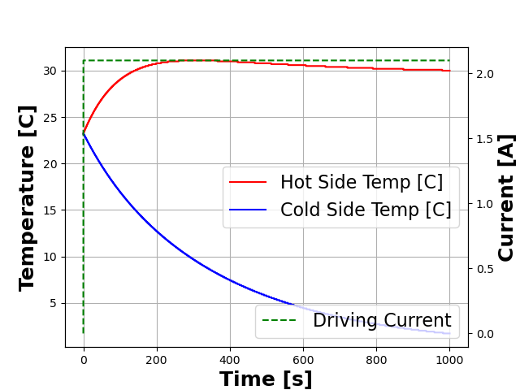
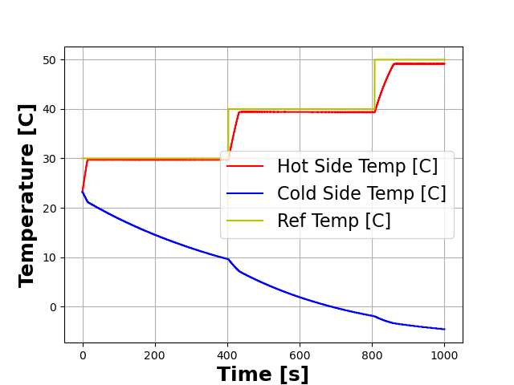
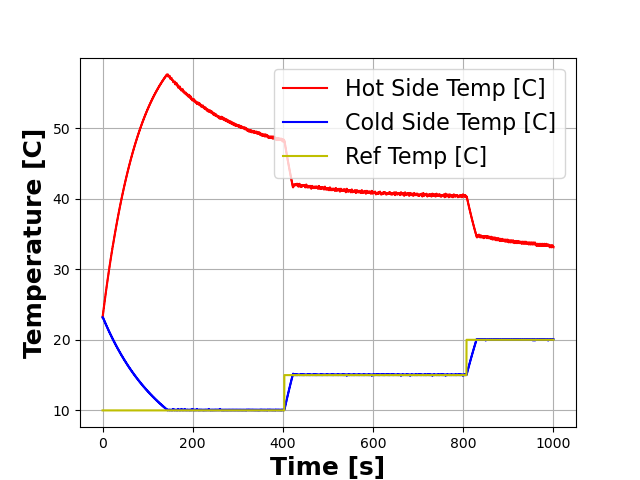

# Summary
Thermoelectric coolers are semiconductor heat pumps that can be used in
precision temperature control applications. After designing a thermoelectric
temperature control system, the primary challenge is tuning and testing
control algorithms. For instance, developing proportional-integral-derivative
controllers involves tuning gains until the desired characteristic is observed, a
tedious, time-consuming process. Furthermore, experimenting with new algorithms
not only takes a long time, but may also run the risk of damaging the 
hardware. We propose a faster-than-real-time temperature control simulation
library, called OpenPelt. OpenPelt contains utilities for developing and
verifying temperature control algorithms as well as a model of a thermoelectric
cooler to act as the plant. OpenPelt also enables exporting simulation
results to Fenics to simulate the control system's impact on three-dimensional
heat diffusion models.

# Statement of need
Thermoelectric coolers (TECs) are semiconductor heat pumps used in various applications [@CHEIN20042207].
For instance, when heat sinking and fans will not suffice in electronics cooling
applications, a TEC can be used as an alternative. Similarly, TECs can be used
to cool down components in lasers and volatile organic compound
detectors [@MansourPaper; @MOSIERBOSS200315].

Designing TEC-based temperature control systems involves overcoming two primary
challenges. One of these is hardware design. The other is control algorithm
development, such as the tuning of proportional-integral-derivative controllers.
The latter is particularly time-consuming. The time to reach a target
temperature with a thermoelectric cooler can be on the order of a minute.
To observe an oscillatory temperature characteristic fully settle can take
a few additional minutes. In order to fully understand the performance of a
control algorithm with particular parameters, one may need to endure these
several-minute delays repeatedly. The result is a very arduous process.
Self-tuning algorithms exist in the literature that partially resolve these
issues. However, it is wise to prototype any control algorithm in a simulation
beforehand for faster-than-real-time result acquisition and to avoid potentially
damaging the TEC hardware with overdrive scenarios.

Furthermore, traditional control theory is undergoing a revolution in light of
developments in machine learning and artificial intelligence. In recent
years, neural networks and even reinforcement learning algorithms have been
applied to temperature controllers [@degrave2022magnetic]. OpenPelt currently includes rudimentary
support for developing such control algorithms. The repo contains an example
randomized neural network test, which is included as a proof of concept for using neural networks in OpenPelt.
Training the network is out of the scope of the present work.
Furthermore, OpenPelt offers support for training reinforcement learning control algorithms.
We have an example test case of a naive agent consuming random actions to control the TEC plate's temperature.
These capabilities in OpenPelt can enable future
neural control theory research, using a thermoelectric cooler as a test
actuator.

# Object-Oriented SPICE-based Thermoelectric Cooler Model

To our knowledge, no out-of-the-box, open-source solution for TEC controller simulation
exists. This is partly due to the lack of a usable open source model of a
thermoelectric cooler and the lack of open source software to simulate it.
We investigated the literature and found an electro-thermal circuit model
of a TEC [@848895]. Though the SPICE netlist is publicly available, there is no straightforward
approach for simulating a traditional, let alone novel, control algorithm.

We wrote a circuit netlist for the TEC model and buried the implementation
details in a ``tec_plant`` class. We then developed test and controller objects
that enable rapid testing of control algorithms on instances of this ``tec_plant`` class.
Firstly, one needs access to an open source SPICE simulator, ngspice in our case.
The simulator then needs to support external current/voltage sources, so that
a user's Python function can generate the driving value to the simulator on
each timestep given the temperatures measured in previous timesteps. Prior
to our development effort, the external current source functionality in ngspice
was broken. We fixed the bug, thereby enabling such sources.

We felt it was critical that users be able to write high-level, object-oriented
code and use it to interact with the TEC model. We used the PySpice library
as a wrapper around ngspice to export the simulator's shared library
functionality to Python [@PySpice].

We default the ``tec_plant`` model parameters, such as thermal capacitance
and resistance values, to the values in the original paper. However, users
are able to modify them with their experimental results or theoretical
approximations. In the future, we would like to provide detailed models of
circuit component values and have the class infer those parameters based on
the geometric and material properties of the TEC described. We would also
like to be able to provide a physical model of the temperature sensor
and its coupling to the TEC. Currently, controllers have no overshoot due
to the ideality of the sensor and its coupling to the TEC.

Furthermore, the model is useful for relatively low-power control of the TEC.
However, at higher power levels, the TEC heats up and thermal drift affects
the circuit parameters. This is also a desirable future feature, but there are
unlikely to be very many applications in which this is useful.

We ultimately chose a circuit model for two reasons. Firstly, circuit models
are computationally simple and efficient since they are solved using
iterative methods for systems of differential equations. However,
a more subtle advantage is that electrical, thermal, hydraulic, mechanical, etc.
systems can all be modeled using circuits. Thus, the library could in principle
be extended to support control systems with a variety of actuators without
the simulator becoming any more complicated and without the use of additional
simulators. Users need only develop a circuit model for the actuator of
interest. This also enables reuse of controller algorithms and test code
for systems of diverse control parameters, such as a cell incubator requiring
various gas concentrations, humidity levels, and temperature to be controlled.

The ``tec_plant`` model supports preliminary three-dimensional finite element simulation
as well. Class methods enable the user to incorporate the results of the
controller simulation into a three-dimensional model described using the  
Fenics library [@LoggEtal2012] [@LoggWells2010]. For the time being OpenPelt
supports only legacy Fenics. However, it's up to end-users if they would like 
to use the most modern Fenics implementation. 
Thus, users can see how the TEC interacts with more complex systems.

# Sample Results
We reproduced figure 11 from the original paper using OpenPelt and a controller
that drives a constant 2.1A current [@848895].

``
        plate_select = OpenPelt.TECPlate.HOT_SIDE
        pC = OpenPelt.tec_plant("Detector",
                                  lambda t , Th_arr : 2.1@u_A,
                                  OpenPelt.Signal.CURRENT,
                                  plate_select)
        pC.run_sim()
        pC.plot_th_tc(OpenPelt.IndVar.TIME)
        plt.show()
``

We have also developed proportional temperature controllers using OpenPelt.
OpenPelt provides functionality for cycling through different reference
temperatures in a test sequence.

``
        plate_select = OpenPelt.TECPlate.HOT_SIDE
        pC = OpenPelt.tec_plant("Detector",
                                None,
                                OpenPelt.Signal.VOLTAGE,
                                plate_select=plate_select,
                                steady_state_cycles = 400)
        cbs = OpenPelt.circular_buffer_sequencer([30.00, 40.00, 50.00], pC.get_ncs())
        pidc = OpenPelt.pid_controller(cbs, 15.00, 0.00, 0.00, plate_select=plate_select)
        pC.set_controller_f(pidc.controller_f)
        pC.run_sim()
        pC.plot_th_tc(OpenPelt.IndVar.TIME, plot_driver = False, include_ref = True)
        plt.show()
``

``
        plate_select = OpenPelt.TECPlate.COLD_SIDE
        pC = OpenPelt.tec_plant("Detector",
                                None,
                                OpenPelt.Signal.VOLTAGE,
                                plate_select=plate_select)
        cbs = OpenPelt.circular_buffer_sequencer([10.00, 15.00,
                                                  20.00, 25.00],
                                                  pC.get_ncs())
        pidc = OpenPelt.pid_controller(cbs, -150.00, 0.00, 0.00,
                                       plate_select=plate_select)
        pC.set_controller_f(pidc.controller_f)
        pC.run_sim()
        pC.plot_th_tc(OpenPelt.IndVar.TIME, plot_driver = False, include_ref = True)
        plt.show()
``

# Bibliography
